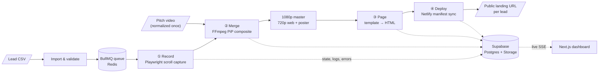

# Personalizer

**Media automation pipeline that turns a CSV of leads into personalized outreach videos and landing pages, with no manual editing.**

[](https://github.com/Niksa1101/Personalizer/actions/workflows/ci.yml)


For every lead, Personalizer opens their website in a headless browser, **records a smooth scroll-through**, **composites** it with a pre-recorded pitch video (picture-in-picture circular bubble), **encodes** a 1080p master plus a 720p web-optimized cut, **generates** a mobile-first landing page, and **deploys** it to a public URL. You get one link per lead that can go straight into an outreach email.

The recipient sees *their own website* within the first two seconds. The pitch stays the same for everyone; only the context changes.

---

## Why "media automation"

Personalized video prospecting is usually done by hand: open the prospect's site, screen-record, drop the recording into an editor, add a face-cam, export, upload, repeat. Personalizer replaces that loop with a queue-driven pipeline that runs unattended over batches of 50–100 leads:

| Manual workflow | Personalizer |
|---|---|
| Screen-record each website by hand | Playwright captures the page with lazy-load forcing, cookie-banner dismissal and an eased `requestAnimationFrame` scroll |
| Trim and time the recording in an editor | Master-clock math stretches or holds the recording so the output **always matches the intro's length to within one frame** |
| Add a face-cam overlay | FFmpeg filter graph composites a circular PiP bubble (4 corners, rectangle or full-screen layouts) |
| Export and upload | 1080p H.264 master + 720p `+faststart` web cut (streams before fully downloaded) + poster frame, uploaded to storage |
| Build a page and share it | Template-driven, `noindex`, zero-third-party landing page, deployed to Netlify as a full-manifest sync |
| Track what broke | Every failure is classified (DNS, timeout, captcha, parked domain, login wall, empty page…) and retryable from the UI |

## Pipeline



Each step is **idempotent and resumable**. A recording is reused across campaigns instead of re-crawled, a crash mid-upload resumes to the same reserved storage key, and a retry picks up at the step that failed.

## Engineering highlights

- **Frame-accurate video timing.** `lib/video/merge-plan.ts` computes a stretch factor for each lead so the website recording fills exactly the intro's duration. If the recording is too short it uses a speed floor plus a freeze-frame hold, and records which fallback it used.
- **Cross-platform FFmpeg quirks.** The circular mask uses a `format=gray,geq` → `alphamerge` chain because the textbook `format=rgba,geq=a=…` silently drops the bubble on Windows builds. A 9-point pixel-sampling check verifies it.
- **Streaming-ready output.** The web cut is checked for `moov`-before-`mdat` box order, so playback starts before the download finishes.
- **Robust website capture.** A shared browser runs a separate context per lead. The capture forces lazy-loaded images, waits for fonts to settle, dismisses cookie banners within a hard 2s budget, and trims the capture to the scroll window so load time never inflates the duration.
- **Failure taxonomy, not stack traces.** Capture errors map to operator-facing codes (`dns_failure`, `nav_timeout`, `captcha`, `parked_domain`, `login_required`, `empty_page`…). Each code is marked terminal or retryable, and the error docs are generated from code (`docs/Errors.md`).
- **Safe deploys.** Netlify deploys are full-manifest replacements, so the worker has an ownership guard, a Redis lock and a mass-removal floor to keep one bad sync from wiping the site.
- **Operator UI.** A Next.js 16 / React 19 dashboard shows live SSE progress, a lead drawer with in-browser playback, queue health polling, filterable logs, retention/cleanup settings and CSV export.
- **Security posture.** Single-operator session auth (HS256, throttled login, origin checks) and RLS on every table. The GitHub Action uses only an insert-only anon key; the service-role key never leaves the machine.

## Tech stack

| Layer | Tools |
|---|---|
| Media | **FFmpeg / ffprobe** (static binaries), H.264 + AAC, filter graphs |
| Capture | **Playwright** (Chromium), injected scroll driver |
| Queue / worker | **BullMQ** on **Redis**, Node worker process with boot recovery and heartbeats |
| App | **Next.js 16** (App Router, Server Actions, SSE), **React 19**, TypeScript, Tailwind v4, shadcn/ui (Base UI) |
| Data | **Supabase** Postgres (30+ migrations, RPCs, RLS) + Storage |
| Hosting of output | **Netlify** deploy API |
| Quality | `node:test` + `tsx`, ESLint, `tsc --noEmit`, GitHub Actions CI on Windows |

## Testing

```bash
npm test          # ~400 unit tests: no server, no database, no .env needed
npm run typecheck
npm run lint
```

The unit suite covers the pure logic behind the pipeline: merge-plan geometry and timing, FFmpeg argument builders, the ffprobe parser, transcode serialization, capture error classification, scroll easing, deploy manifest diffing, CSV import/export, settings schema, session handling and more.

Some tests also exercise **real media end to end with no external services**. For example, `lib/video/probe.test.ts` synthesizes clips with the bundled FFmpeg, probes them, and normalizes a silent 4:3 clip to 1080p / 30 fps with a generated stereo track. It then checks the result with ffprobe.

On top of that, 27 `npm run verify:*` scripts check wire contracts, database behaviour and the rendered UI (Chromium) against a running stack. See [docs/SETUP.md](docs/SETUP.md#verification).

## Quickstart

Requirements: Node ≥ 20.9, Docker (for Redis), plus a Supabase project and an **empty** Netlify site.

```bash
git clone https://github.com/Niksa1101/Personalizer.git && cd Personalizer
npm install
npx playwright install chromium
cp .env.example .env.local        # fill in the eight required values
npx supabase link --project-ref <your-project-ref>
npx supabase db push
npm run redis:up
npm run seed
npm run dev                       # http://127.0.0.1:3000
npm run worker                    # second terminal
```

The full operator guide covers account setup, every environment variable, keep-alive, verification and a 14-item troubleshooting table: **[docs/SETUP.md](docs/SETUP.md)**.

## Project layout

```
app/          Next.js routes: dashboard, campaigns, leads, queue, logs, settings, API + SSE
components/   UI (shadcn/ui on Base UI)
lib/          Domain logic; lib/video/ holds merge planning, FFmpeg args, probe, transcode lock
worker/       Background pipeline: recorder/, video/, page/, deploy/, cleanup/, steps/
supabase/     SQL migrations and seed
scripts/      verify:* acceptance harness, fixtures, generators
docs/         PRD, technical design, DB schema, error reference, setup guide
```

## Documentation

- [docs/PRD.md](docs/PRD.md): product scope, workflows and build phases
- [docs/Tech.md](docs/Tech.md): architecture, capture, merge math, deploy and auth
- [docs/DB.md](docs/DB.md): schema and migrations
- [docs/Errors.md](docs/Errors.md): generated error-code reference
- [docs/SETUP.md](docs/SETUP.md): setup, operations and troubleshooting

## Scope

Personalizer is the middle stage of a three-app outreach system: **Lead Finder → Personalizer → Outreach**. It is a local, single-operator tool by design, not a multi-tenant SaaS. It deliberately uses **no AI** and **no tracking**. The pitch is a real recorded video, the page copy comes from the operator's template, and landing pages carry no analytics or third-party requests.
